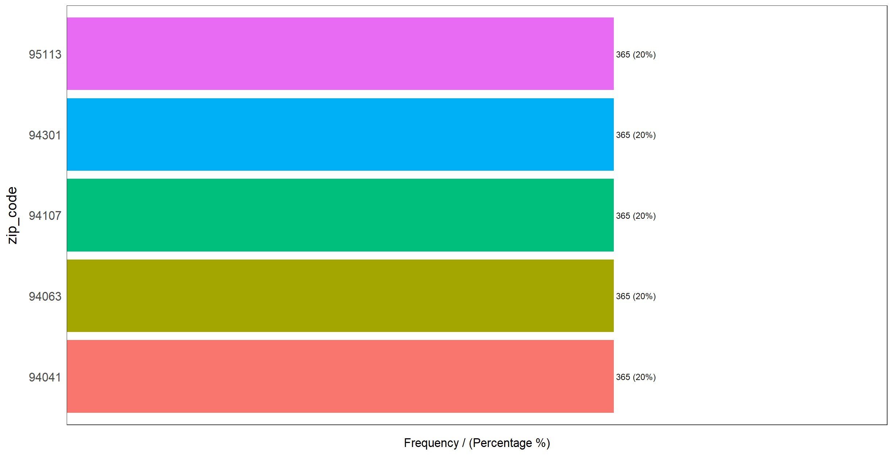
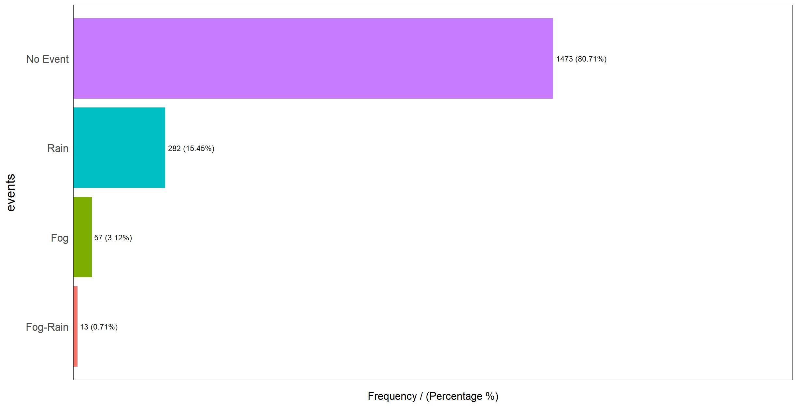

```{r setup, include=FALSE}
knitr::opts_chunk$set(echo = TRUE, results = 'hide',  warning=FALSE, message=FALSE, fig.show='hide')
```

## Exploratory Data Analysis of the Weather Dataset

### R code:
```{r weather_EDA}
library(funModeling)
library(tidyverse)
library(Hmisc)
library(stringr)
library(dplyr)

# Import weather dataset as a dataframe
weather_data <- read.csv("weather.csv", header = TRUE, sep = ",")

# Head the first observations and view the total number of observations and variables
glimpse(weather_data)
  # 1825 total observations
  # 15 variables
  # Data is in imperial measurements (F, miles, mph, inches)

# Replace T values in precipitation_inches with 0 and convert to numeric
weather_data$precipitation_inches <- stringr::str_replace(weather_data$precipitation_inches, "T", "0")
weather_data <- weather_data %>% mutate(precipitation_inches = as.numeric(precipitation_inches))

# Replace empty values with "No Event" in events
weather_data$events[weather_data$events == ""] <- "No Event"
weather_data$events[weather_data$events == "rain" | weather_data$events == "Rain-Thunderstorm"] <- "Rain"

# Convert zip_code to character 
weather_data$zip_code <- as.character(weather_data$zip_code)

# Gain metrics on data types, zeroes, infinite numbers, and missing values
print(status(weather_data))

# Analyze categorical variables
freq(weather_data) 

  #Export frequency plots to current directory
  freq(weather_data, path_out = ".")
     
print(profiling_num(weather_data))

# Analyze numerical variables
plot_num(weather_data)

  plot_num(weather_data, path_out = ".")

describe(weather_data)
  # Consistent observations with above

saveRDS(weather_data, "weather_processed.rds")
```

  Pre-processing steps were applied before data analyses began. “T” values representing trace
amounts of precipitation within the precipitation_inches variable were converted to 0 and the variable was converted to numerical. “rain” was converted to “Rain” in the events variable to
properly group the variable. Within the events variable, there were 1473 observations that were
null. These observations were converted to “No Event”, indicating that no weather event took
place. The variable zip_code was converted to a categorical variable from numerical as there were
only 5 zip codes, one for each of the cities described in the dataset.

  Within the weather dataset there are a total of 1825 observations and 15 variables. 5
(0.27%) observations for each date were present in the data set and ranged from 1/1/2014 to
6/15/2014. In the city variable there were 365 (20%) observations from Mountain View, 365 (20%)
observations from Palo Alto, 365 (20%) observations from Redwood City, 365 (20%) observations
from San Francisco, and 365 (20%) observations from San Jose (Figure 1). Similarly, the zip codes
within the zip_codes variable were general and represent each of the regions. 365 (20%)
observations were present for 94041 (Mountain View), 365 (20%) observations for 94301 (Palo
Alto), 365 (20%) observations for 94063 (Redwood City), 365 (20%) observations for 94107 (San
Francisco), and 365 (20%) observations for 95113 (San Jose) (Figure 2) Of these dates, 1473
(80.71%) were recorded as undergoing no weather event across all cities, 282 (15.45%) were noted
to experience rain, 57 (3.12%) had fog documented across all cities, and 13 (0.71%) had both fog
and rain (Figure 3).




  Within the numerical variables, 1616 (88.55%) of observations for precipitation_inches
were zero. 451 observations for maximum gust speed were missing (24.71%), thus maximum gust
speed had less than 80% of all values as non-NA values. The mean of maximum temperature was
271.03 with a standard deviation (SD) of 8.26. The mean of mean temperature was 62.04 with an SD of 6.75. The mean of minimum temperature was 52.83 with an SD of 6.67. The mean of max visibility was 10.86 with an SD of 2.62. The mean of mean visibility was 9.97 with an SD of 1.62. The mean of minimum visibility was 8.11 with an SD of 3.04. The mean of maximum wind speed 16.43 was with an SD of 7.32. The mean of mean wind speed was 6.11 with an SD of 3.05. The mean of maximum wind speed was 22.69 with an SD of 9.09. Precipitation had an extremely high variation of coefficient of 5.97 and broad 98-percentile range of 9-45.81, indicating the presence of outliers. The mean precipitation was 0.03 with an SD of 0.18 as well. The variable describing cloud cover had a mean of 3, with an SD of 2.30. Representative histograms can be found in Figure 2.


## Exploratory Data Analysis of the Trip Dataset

### R code:

```{r trip_eda}

library(funModeling)
library(tidyverse)
library(Hmisc)
library(stringr)
library(dplyr)

# import the trip dataset as a datafram 
trip_data <- read.csv("trip.csv")

# setup basic_eda function 

trip_eda <- function(trip_data)
{
  glimpse(trip_data) 
          
  print(status(trip_data))
  
  freq(trip_data)

  # export plots
  freq(trip_data, path_out = ".")
  
  
  print(profiling_num(trip_data))

  plot_num(trip_data)
  
  #export plots
  plot_num(trip_data, path_out = ".")
  
  describe(trip_data)
  # 1493 missing zip_code
}

# run the above function for trip_data
trip_eda(trip_data)

```

  The trip dataset contained 326,339 trip observations of 11 variables from 01/01/2014 to 09/09/2014. Within the 11 variables there was one numerical variable, duration, and the rest of the variables were categorical; id, start station id, end station id, bike id, start date, start station name, end date, end station name, subscription type, and zip code. The zip code variable contains a total of 50 observations that were recorded as 0’s and can be interpreted as NAs; all other data was complete.
  
  There was an average trip duration in seconds was ~1132 seconds. The duration data is also skewed to the right, has a high variance (27), and high standard deviation (30816). Out of the 74 different stations, San Francisco Caltrain (Townsend at 4th), had the highest frequency with 25144 (7.7%) start station observations (Figure 4) and 33213 (10.18%) end station observations (Figure 5). Figure 6 displays the frequency of trips that were made by subscribers and customers.It was found that ~85% (277763 observations) of the trips from this data set were from subscribers and the other ~15% (48576 observations) of the trips were from the customers.
  


## Cancelled Trips

### R code:

```{r cancelled_trips}
library(dplyr)

# find the trips with duration less than 2 minutes
trip_data_cancelled <- filter(trip_data, trip_data$duration < 120)

# remove cancelled trips from data set 
trip_data2 <- trip_data %>%
  filter(trip_data$duration >= 120)


saveRDS(trip_data2, "trip_data2.rds")
```
  
  Within the trip dataset cancelled trips were identified to be trips with duration less than 2 minutes. It was found that there was a total of 2499 cancelled trips within this dataset, these observations are stored in the trip_data_cancelled dataframe and removed from the original dataset.
  
## Outliers

### R code:
```{r outliers}
# trip data outliers 

trip_data2 <- readRDS("trips_2minutes.RDS")

# create a dataframe to store trip data outliers
trip_outliers <- data.frame()

# create a box plot for the trip data for numeric variables
# box plot for duration
boxplot(trip_data2$duration) # outliers present
# find the outliers in duration
duration_outliers <- boxplot.stats(trip_data2$duration)$out
# find row numbers for duration outliers
duration_outliers_rownum <- which(trip_data2$duration %in% c(duration_outliers))
duration_outrows <- trip_data2[duration_outliers_rownum,]
# add the outliers to the trip outliers_dataset
trip_outliers<- rbind(trip_outliers, duration_outrows)
# remove outliers from trip_data2 and store in new dataset
trip_data3 <- trip_data2[-duration_outliers_rownum,]

saveRDS(trip_data3, "trip_no_outliers.rds")

################################################################################## 
# weather data outliers 

weather_data <- readRDS("weather_processed.rds")

# create a dataframe from store weather data outliers 
weather_outliers <- data.frame()
weather_data2 <- weather_data

# create a box plot for the weather data for numeric variables
# box plot for mean_temperature_f
boxplot(weather_data$mean_temperature_f) # no outliers present

# box plot for min_temperature_f
boxplot(weather_data$min_temperature_f) # outliers present
# find the outliers in min_temperature_f
mintemp_outliers <- boxplot.stats(weather_data$min_temperature_f)$out
print(mintemp_outliers)
# find row numbers for min_temperature_f outliers
mintemp_outliers_rownum <- which(weather_data$min_temperature_f %in% c(mintemp_outliers))
mintemp_outrows <- weather_data[mintemp_outliers_rownum,]
# add the outliers to the weather_outliers dataset
weather_outliers<- rbind(weather_outliers, mintemp_outrows)
# remove outliers from weather_data and store in new dataset
weather_data <- weather_data[-mintemp_outliers_rownum,]

# box plot for max_temperature_f
boxplot(weather_data$max_temperature_f) # outliers present
# find the outliers in max_termperature_f
maxtemp_outliers <- boxplot.stats(weather_data$max_temperature_f)$out
# find row numbers for max_termperature_f outliers
maxtemp_outliers_rownum <- which(weather_data$max_temperature_f %in% c(maxtemp_outliers))
maxtemp_outrows <- weather_data[maxtemp_outliers_rownum,]
# add the outliers to the weather_outliers dataset
weather_outliers<- rbind(weather_outliers, maxtemp_outrows)
# remove outliers from weather_data and store in new dataset
weather_data <- weather_data[-maxtemp_outliers_rownum,]

# box plot for mean_visibility_miles
boxplot(weather_data$mean_visibility_miles) # outliers present, but IQR is 0, ignore

# box plot for min_visibility_miles
boxplot(weather_data$min_visibility_miles) # outliers present, but distribution is one sided, ignore

# box plot for max_visibility_miles
boxplot(weather_data$max_visibility_miles) # outliers present, but IQR is 0, ignore

# box plot for mean_wind_speed_mph
boxplot(weather_data$mean_wind_speed_mph) # outliers present
# find the outliers in mean_wind_speed_mph
mean_wind_outliers <- boxplot.stats(weather_data$mean_wind_speed_mph)$out
# find row numbers for mean_wind_speed_mph outliers
mean_wind_outliers_rownum <- which(weather_data$mean_wind_speed_mph %in% c(mean_wind_outliers))
mean_wind_outrows <- weather_data[mean_wind_outliers_rownum,]
# add the outliers to the weather_outliers dataset
weather_outliers<- rbind(weather_outliers, mean_wind_outrows)
# remove outliers from weather_data and store rows without outliers in new dataframe
weather_data <- weather_data[-mean_wind_outliers_rownum,]

# box plot for max_wind_speed_mph
boxplot(weather_data$max_wind_Speed_mph) # outliers present
# find the outliers in max_wind_speed_mph
max_wind_outliers <- boxplot.stats(weather_data$max_wind_Speed_mph)$out
# find row numbers for max_wind_speed_mph outliers
max_wind_outliers_rownum <- which(weather_data$max_wind_Speed_mph %in% c(max_wind_outliers))
max_wind_outrows <- weather_data[max_wind_outliers_rownum,]
# add the outliers to the weather_outliers dataset
weather_outliers<- rbind(weather_outliers, max_wind_outrows)
# remove outliers from weather_data and store rows without outliers in new dataframe
weather_data <- weather_data[-max_wind_outliers_rownum,]

# box plot for max_gust_speed_mph
boxplot(weather_data$max_gust_speed_mph) # outliers present
# find the outliers in max_gust_speed_mph
max_gust_outliers <- boxplot.stats(weather_data$max_gust_speed_mph)$out
# find row numbers for max_gust_speed_mph outliers
max_gust_outliers_rownum <- which(weather_data$max_gust_speed_mph %in% c(max_gust_outliers))
max_gust_outrows <- weather_data[max_gust_outliers_rownum,]
# add the outliers to the weather_outliers dataset
weather_outliers<- rbind(weather_outliers, max_gust_outrows)
# remove outliers from weather_data and store rows without outliers in new dataframe
weather_data <- weather_data[-max_gust_outliers_rownum,]

# box plot for precipitation_inches
boxplot(weather_data$precipitation_inches) # heavily skewed
#Apply log transformation
log_precip <- log(weather_data$precipitation_inches)
hist(log_precip)

saveRDS(weather_data, "weather_no_outliers.rds")


```

  The outliers for the trip and weather dataset were evaluated by constructing box plots for each numerical variable and using the boxplot.stats( ) function in R to identify the outliers. The function essentially looks for values of the datapoints which lie beyond the extremes of the whiskers of the boxplot and removes them per the 1.5IQR rule. There were a total of 24927 outliers in the trip dataset this data is stored in the trip_outliers dataframe, and all outliers were extracted from the duration variable. The cleaned trip dataset is stored in the trip_no_outliers dataset.
  
  There were a total of 80 outliers in the weather dataset and were stored in the weather_no_outliers dataset. Outliers were evaluated for the following variables within weather dataset: mean temperature, minimum temperature, maximum temperature, mean visibility, minimum visibility, maximum visibility, mean windspeed, maximum wind speed, maximum gust speed, and precipitation. Mean temperature did not contain any outliers. Minimum visibility contained outliers, however the distribution was onesided and thus the outliers were removed. The boxplot for precipitation also showed the data too be heavily and the outliers were ignored for this variable as well. Both mean and minimum visibility had outliers with an IQR of 0 so the outliers were ignored for these variables. The minimum and maximum temperature variables each had one outlier that were stored in the mintemp_outrows and maxtemp_outrows dataframes respectively. Mean wind had 19 outliers that were stored in mean_wind_outrows, maximum wind had 14 outliers that are stored in max_wind_outrows, and maximum gust had 44 outliers that were stored in max_gust_outrows. The cleaned weather dataset was stored in the weather_data dataset.
  
  